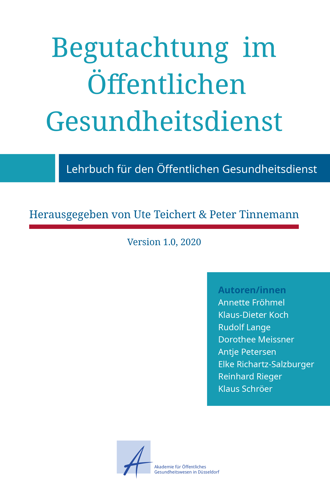

{:.imgcover}
*Begutachtung im Öffentlichen Gesundheitsdienst - Lehrbuch für den Öffentlichen Gesundheitsdienst*

Das Erstellen von Gutachten, insbesondere für öffentliche Auftraggeber,
ist eine zentrale Aufgabe von Ärztinnen und -ärzten in den
amtsärztlichen Diensten der Gesundheitsämter und anderer Einrichtungen
des Öffentlichen Gesundheitsdienstes. Es kann auch zukünftig davon
ausgegangen werden, dass die Erstellung von Gutachten ein fester
Bestandteil des ÖGD bleibt.

Die vielfältigen Begutachtungsanlässe im Öffentlichen Gesundheitsdienst
werfen immer wieder neue Fragen auf. Daher ist es notwendig
diesbezügliche Standards einzuführen, um neben der Orientierung an
Rechtsnormen, Rechtsprechung und Stand der Wissenschaft hohe Qualität
sicherstellen zu können.

Mit dem vorliegenden Lehrbuch stellen wir ein zentrales Werk für die
gutachterliche Tätigkeit für ärztliche Kollegen/innen zur Verfügung. Es
stellt länderübergreifend die Lehrmeinung zu Begutachtung im ÖGD dar und
ist ein Standardwerk zur Orientierung für die alltägliche praktische
Arbeit in den Gesundheitsämtern. Darüber hinaus unterstützt es die
Qualitätsentwicklung und Qualitätssicherung in der amtsärztlichen
Begutachtung.

Die in diesem Lehrbuch zusammengefassten Inhalte beruhen auf jahrelanger
theoretischer Auseinandersetzung und praktischer Erfahrung der
Autoren/innen im ÖGD. **Das vorliegende Lehrbuch ist ein
Gemeinschaftswerk aller beteiligten Autorinnen und Autoren und ist nicht
die Meinung einzelner Institutionen oder einzelner Autoren und
Autorinnen.**

Der oder die Person, die begutachtet wird, ist kein Patient, kein
Klient, kein Proband sondern: Versicherte/r, Beamtin/er, Beschäftigte/r,
Beihilfeberechtigte/r, Verunfallte/r. Im Sinne der leichteren Lesbarkeit
haben wir uns für den Begriff: „Proband/in“ entschieden, wohl wissend,
dass dieser Begriff die Rechtsstellung der/des zu Begutachtenden nicht
korrekt darstellt. Uns geht es auch darum, den Begriff:
Patientin/Patient zu vermeiden, um klarzustellen, dass es sich hier
nicht um kurative sondern gutachterliche Tätigkeiten handelt.

Dieses Lehrbuch wird zukünftig aktualisiert und erweitert werden. Wir
freuen uns daher, wenn Sie uns Ihre Anregungen, Kommentare und
Ergänzungen mitteilen. Schicken Sie diese bitte an
lehrbuch@akademie-oegw.de

Wir nutzen
**[Hypothes.is](https://hypothes.is/ "https://hypothes.is/")** für Ihre
Kommentare und Ergänzungen unseres Lehrbuches.
